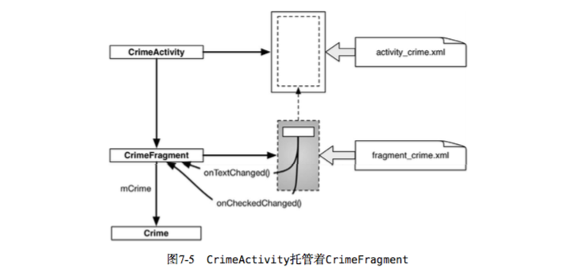

# 第一章-開發初體驗

- activity默認佈局
Widget:RelativeLayout、TextView

- Option+Return(Alter+Enter) 快捷鍵導入view

- AVD = 安卓的虛擬設備模擬器

- Android 編譯:
資源文件 + 代碼 + AndroidManifest.xml => 生成 .apk 文件
    ```
    ps.
    apk文件在模擬器上運行需要 debug   key 簽名
    apk文件在用戶機上運行需要 release key 簽名
    ```
    ```
    ps2.
    編譯過程中
    佈局文件(activity.xml  ...etc)會透過 aapt(Android Asset Packaging Tool)
    編譯並壓縮後打包到apk文件內
    ```

- 手動編譯(直接使用gradle指令行)
./gradlew tasks

- android 編譯流

    
    


# 第二章-Android與MVC設計模式

- 在Android的世界裡 Controller通常是 Activity , Fragment ,Service

- adb = (Android Debug Bridge)
有時接上設備後找不到裝置，是因為系統找不到這個驅動，此時會需要到設備商下載

- mdpi (160dpi) < hdpi (240dpi) < xhdpi(320dpi) < xxhdpi(480dpi)

- xml 引用資源pattern => android:text="@string/xxx"

# 第三章-Activity的生命週期


- 實體按鍵點擊行為
    * 點擊設備的返回鍵 -> activity 已不需要 -> onDestroy()
    * 點擊設備的主屏鍵 -> activity 可能還需要 -> onStop()
    * 點擊設備的概覽屏鍵(或雙擊主屏鍵) -> onPause()

- android  6.0+ 的多窗口模式-> 可能出現用戶全可視的 Pause State

- Bundle 為字符串鍵-基本型別值 的 key-value結構

- Android不會為了回收內存而銷毀可見的activity，只有onStop後的才可銷毀


- 旋轉設備會改變設備配置，因此會需要重建 activity 保存上一個 activity 變量的 solution

- 
    ```java
    protected void onSaveInstanceState(Bundle outState)
    ```
    * onSaveInstanceState 通常會在onStop前呼叫，但如返回鍵等，預設不需要繼續運行activity的操作則可能不會呼叫


    * override onSaveInstanceState  -> 儲存暫存狀態數據

    * override onStop               -> 儲存永久數據

- 設備的開發者設置有 Don't keep activites 選項，可用來模擬回到主屏等，activity被回收內存的狀況。

- log e(錯誤)>w(警告)>i(訊息)>d(除錯)>v(開發)


# 第四章-Android應用調適

- Android Lint (Android的靜態分析器) 

- R類資源出問題時的調適步驟
    1. 檢查資源文件有效性
    2. 清理項目( Build -> Clean Project )
    3. 使用 Gradle 同步項目
    4. 運行 Android Lint

# 第五章-第二個Activity

- 創建Activity必要三文件: Java類、XML布局、應用的Manifest，因此建議使用 IDE自帶的響導新建Activity

- Android操作系統裡有ActivityManager負責處理Activity的創建請求，startActivity(Intent)的靜態方法並非是調用Activity子類方法來建立實體。

- 若要啟動應用但單純回傳結果可以調用
startActivityForResult()

- 啟動Activity前，ActivityManager會確認class是否已在manifest中宣告，否則丟出ActivityNotFoundException

- intent 是component用來與操作系統通信的媒介

- 我目前已知的component：activity、service、broadcast receiver、content provider

- intent 種類
    * 顯式 intent
        - 透過指定Context與Class對象，然後呼叫intent建構子來創建intent
        - 在同一應用中，一般使用顯式 intent
    * 隱式 intent
        -  15章介紹


- 同一應用的兩個Activity卻必須透過應用外部的ActivityManager來溝通有點怪，但這是為了有利於不同應用之間Activity的交互。

    ```java
    傳遞方
    Intent intent = new Intent(this, ResultActivity.class); // this代表當前的component ,後者是接收方類
    intent.putExtra("FOO_EXTRA", foo);
    startActivity(intent);


    接收方
    Intent intent = getIntent();
    String foo = intent.getStringExtra("FOO_EXTRA", 0);

    ```


- 完整的應用交互


- 啟動應用時，操作系統會先啟動應用中的 lanucher activity，並用一個Activity stack來管理

- 通常lanucher activity會宣告在manifest的inetent-filter元素下


# 第六章-Android SDK版本與兼容

- 可至此查詢各版本分佈狀況
https://developer.android.com/about/dashboards/

* minSdkVersion (SDK最低版本)
    - 操作系統會拒絕將應用安裝在系統版本低於標準的設備上
* targetSdkVersion (SDK目標版本)
    - 告知Android，此應用是為哪個API級別設計的
    - https://developer.android.com/reference/android/os/Build.VERSION_CODES
    - 降低SDK目標版本可以保證的是，即便在高於目標版本的設備上，應用仍可運行，且與目標版本保持一致，會忽略新版本中的變化。
* compileSdkVersion (SDK編譯版本)
    - 此訊息不會出現在 manifest文件內，是僅為你和編譯器間的私有信息
    - 決定了編譯後版本，而android studio在尋找和導入語句中的類別或方法時，會以此為基準。

- 情境題
    * minSdkVersion 19 ， targetSdkVersion 25 ，此時若使用 21 的api，可能會導致低版本無法使用
        - 若 Lint 有開啟(Analyze -> Inspect Code )，會提示Call require API level 21(Current min is 19)
        - 解決方法
            1. 提高min版本，迴避兼容性問題
            2. 在程式中以條件式來判斷Android版本，做版本兼容

- Android開發者文件
    - https://developer.android.com/docs/

# 第七章-UI fragment 與 fragment管理器

- activity本身因為不具有UI上的佈局彈性，此性能交由fragment達成。<br>
fragment 本身沒有在屏幕上顯現視圖的能力，是依附在activity的層級中。



- 組件階層 Activity -> FrameLayout(container) -> Fragment

- FrameLayout是個通用視圖容器，不單只為了裝Fragment

- ㄒFragment分為原生版本跟資源庫版本
    - Fragment(android.app)
        - 裝置系統實作的，會因為設備不同而異
    - Fragment(android.support.v4.app)
        - 發布時跟著打包在應用的fragment類裡


- Activity託管UI Fragment有兩種方式
    - 在 activity佈局中添加 fragment
    - 在 activity程式中添加 fragment


- Activity 與 Fragment 比較
    - Fragment 的onCreate(Bundle) 為public方法，為了給託管的Activity呼叫
    - Fragment 同樣具有 onSaveInstanceState(Bundle)
    - Fragment 的視圖並不在的 Fragment.onCreate(Bundle)中生成
        - 創建和生成Fragment 的視圖是在 onCreateView( LayoutInflater,  ViewGroup, Bundle)
        - 以上方法，會將實體化的 view 返回給託管的 Activity

- FragmentManager是Activity類中負責管理Fragment的類


-
    ```java
    FragmentManger fm       = getSupportFragmentManger();
    Fragment       fragment = fm.findFragmentById(R.id.fragment_container);
    if(fragment == null){
        fragment = new FooFragment();
        fm.beginTransaction().add(R.id.fragment_container,fragment).commit();
    }
    ```
    以上代碼重點
    - FragmentTransaction 是用來增刪查改 FragmentManger的隊列  FragmentSequence
    - FragmentTransaction 的函式會回傳自身，支援鏈式呼叫(fluent interface)
    - 透過findFragmentById()從FragmentManger的隊列中不一定能獲取到
    - 交易中，R.id.fragment_container(容器資源ID)的作用在於
        1. 告知FragmentManger，Fragment視圖要呈現在Activity視圖的什麼位置
        2. FragmentManger的隊列中Fragment的唯一識別
        3. 基於第二點，Fragment的識別ID是綁定其容器的，因此若需要對Activity添加多個Fragment，通常就需要對每個Fragment創建具有不同ID的容器
    - 添加 fragment 供 FragmentManger管理時，會調用隊列中的fragment的生命週期方法，若是在Activity處於運行狀態添加，則會盡快讓fragment的生命週期與其同步


- appcompat 這是google提供的基礎開發庫，但真正實現fragment功能的是support-v4庫

- getSupportFragmentManger() vs getFragmentManger()
    - android3.0 之前由於沒有 Fragment api，因此必須借助v4包裡的 getSupportFragmentManger()來間接獲取FragmentManger，並且需繼承自FragmentActivity，才能在Activity中嵌入Fragment
    - android3.0 之後有了 Fragment api，能直接使用getFragmentManger()獲取FragmentManger，並且繼承自Activity即可嵌入Fragment


- Fragment 是為了封裝關鍵組件用的，所謂的關鍵組件是依照整個屏幕來說的，單屏大量Fragment不是好的作法(實踐經驗2~3即可)，若是有零碎小組件重用需求可使用定制視圖

# 第八章-使用 RecyclerView

- RecyclerView 是 ViewGroup的子類，每一列表都是作為一個View子物件顯示。

- RecyclerView 是在 support-v7庫
- RecyclerView 的運作機制是先創建一定量的 View實體，然後在特定條件下重複使用這些實體。

- 官方文件術語
    - Adapter       - 負責把 Dataset 裡面的資料，轉成 view 給 RecyclerView 顯示
    - Position      - 在 Adapter 裡面的 data item 的位置
    - Index         - 已掛上 RecyclerView 裡面的 child-view 的位置，用在 getChildAt(int)
    - Binding       - 把資料變成可視的 view 的過程
    - Recycle(view) - 之前曾經被拿來顯示過的 view，現在放在 cache 裡面留待下次使用
    - Dirty(view)   - 需要重新自資料更新外觀的 view
    - Scrap(view)   - 在 Layout 過程被拿下來但是尚未完全 detached。(從原始碼來看，mAttachScrap 放在 class Recycler 底下。


- 要想列表項的View能顯示數據，需要以下類合作
    - RecyclerView ：回收和定位屏幕上的View
    - (內部類)ViewHolder ：容納View視圖
    - (內部類)Adapter ：controller物件，創建必要的ViewHolder，綁定ViewHolder和model層資料
    - LayoutManager ：將RecyclerView擺上屏幕，並負責定義螢幕的滾動行為

- 一個RecyclerView取得所需視圖物件的流程
    1. RecyclerView 呼叫 Adapter 的 onCreateViewHolder(ViewGroup,int) 方法創建 ViewHolder
    2. RecyclerView 呼叫 Adapter 的 onBindViewHolder(ViewHolder,int)，將目標位置的數據綁定到 ViewHolder的視圖上。
    ```
    ps.
    onCreateViewHolder 的呼叫並不頻繁，有了夠用的ViewHolder就不會繼續調用了。
    ```
    ```
    ps2.
    在進行暫時的資料物件存取，創建單例(Singleton)物件是個選擇
    但創建單例物件請謹慎，否則會造成程式內容混亂，又或是尋找DI(依賴注入)工具幫忙控管單例
    例如Android著名的DI庫-Dagger
    http://square.github.io/dagger/
    ```

# 第九章-使用佈局(Layout)與組件(Widget)創建用戶介面

- ConstraintLayout 下的佈局方式
    - 組件位置：添加約束
    - 組件大小：讓組件自動(wrap_content)、手動調整、讓組件佈滿約束範圍

- dp、sp、屏幕像素密度(PPI)
    - px
        * pixel。無論屏幕密度多少，一個像素點對應一個屏幕像素單位，因此不會根據屏幕密度自動縮放。
    - dp(dip)
        * density-independent pixel。與密度無關的像素，1dp在設備屏上總是等於1/160英吋。
    - sp
        * scale-independent pixel。同樣與密度無關的像素，會依照用戶字體偏好設定而影響。
    - pt、mm、in
        * 類似於dp的縮放單位。但實際開發不建議使用，因為並非所以ㄡ設備都能正確進行縮放。

- 安卓設計原則：developer.android.com/design/index.html

- 邊距屬性，android studio默認使用 16dp 或 8dp

# 第十章-使用 fragment argument

- 從 Fragment 啟動 Activity 的方式類似從 Activity 啟動 Activity。使用 Fragment.startActivity(intent)

- Fragment有兩種方式獲取 intent中的資料
    1. 簡單方式
        ```java
        Foo foo = (Foo) getActivity().getIntent().getSerializableExtra(FooActivity.EXTRA_FOO_ID);
        ```
        這不是個好方法，因為這種方式破壞了Fragment的封裝，由特定Activity託管，並定義了intent 含有名為 EXTRA_FOO_ID 的 extra。<br>
        這表示這個Fragment無法再用於其他的Activity。<br>
        更好的作法是讓資料存在FooFragment的某個處(如:argument bundle)，而不是保存在FooActivity的私有空間，如此一來就不用仰賴 intent 的 extra。
    2. fragment argument
        * 創建 Bundle 放入 argument
            ```java
            //第二種方法，Android開發者慣用的作法是添加 newInstance 靜態方法給fragment類。
            //附加argument bundle給fragment
            //時機必須在fragment創建後，添加給Activity前完成
            Bundle args = new Bundle();
            args.putSerializable(FOO_ID, fooObj);
            FooFragment fragment = new FooFragment();
            fragment.setArguments(args);
            ```
        * 取用 argument
            ```java
            Foo foo = (Foo) getArguments().getSerializable(FOO_ID);
            ```
        ```
        ps.
        不直接在Fragment裏創建一個實體變數的原因：
            因為在操作系統重建fragment(設備配置變更，例如轉動)、用戶暫時離開當前應用(系統依需求回收內存)時，任何實體變數都不可靠。
            尤其是內存不足時，操作系統強制閃退的情況更是無人能擋，Fragment argument便是應運而生。
        ```

- 同步model層與列表的資料（例如點擊列表項切換成明細頁，修改資料後返回列表）。
    -  在列表項Activity的 onResume 或 onActivityResult 觸發Adapter.notifyDataSetChanged()。
        ```
        ps.
        notifyDataSetChanged()的效能問題：
            notifyDataSetChanged()會刷新所有可見列表項。
            這有時是不太合實際應用的，因為並非每次都需要刷新全部的列表項。
            此時可以改採用Adapter.notifyItemChanged(int)來進行單獨刷新。
        ```
    - 通過 fragment 返回結果的方法與 Activity 類大致雷同，需注意的是 fragment 只能夠從 activity 中接收返回結果，但自身不主動持有返回結果，因此沒有 setResult()。
    <br>若要使託管的 activity 返回結果值，代碼如下。
        ```java
            public class FooFragment extends Fragment{
                public void returnResult(){
                    getActivity().setResult(Activity.RESULT_OK,null);
                }
            }
        ```


# 第十一章-使用 ViewPager
- 使用新的activity來託管明細頁的fragment，佈局將由ViewPager實體組成，可以讓用戶左右滑動切換屏幕。
    

- ViewPager 是在 support-v4庫

- ViewPager 類似前幾面說過的 RecyclerView 一樣需要 Adapter提供 view
  - 使用 ViewPager.setAdapter(PageAdapter);
  - 範例使用 google提供的 FragmentStatePageAdapter 類，建構子需傳入 FragmentManager
  - ViewPager 預設顯示第一個列表項，要改變預設列表項使用 ViewPager.setCurrentItem(int);


- FragmentStatePageAdapter vs FragmentPageAdapter
    - 唯一區別在於卸載不需要的Fragment時的作法
    - FragmentStatePageAdapter :
        - 對於不需要的Fragment會直接銷毀，transation commit 後 activity的FragmentManager中的Fragment就會被徹底消除。
        - 可在 onSaveInstanceState(Bundle) 方法中保存 fragment的 Bundle 訊息。 <br/>
        用戶可藉此保存的狀態來生成新的 fragment。
        

    - FragmentPageAdapter :
        - 對於不需要的Fragment，會自行呼叫 detach(Fragment)方法來處理。 <br/>
        實體仍存在FragmentManager中，只是銷毀視圖。
        

- 若是有需要託管非Fragment的視圖，例如 ImgaeView ，那就有必要自行實現PageAdapter

- 為何在Fragment切換時不選擇使用RecyclerView？
    - 原因在於RecyclerView的Adapter需要我們及時的提供視圖，而Fragment視圖的創建是仰賴FragmentManager，我們無法立即創建Fragment並提供其視圖。
    - 相對的ViewPager的PageAdapter會處理更多視圖的管理工作，PageAdapter不使用onBindViewHolder(...)方法返回目標視圖，而是使用以下方法
    ```java
        //告知PageAdapter創建指定位置的Item 
        public Object instantiateItem (ViewGroup container, int position)
        //告知PageAdapter銷毀指定位置的Item
        public void   destoryItem     (ViewGroup container, int position, Object object)
        //判斷視圖是來自於哪個Item
        public abstract boolean  isViewFromObject (View view, Object object)
    ```
    instantiateItem()的差別在於，不要求立即創建視圖，因此PageAdapter可以自行決定何時創建，當創建完成後ViewPager就能夠在某個時點看見視圖。
    - isViewFromObject(View view, Object object)的具體實現如下
    ```java
        @Override
        public abstract boolean  isViewFromObject (View view, Object object){
            return ((Fragment)Object).getView() == view ;
        }
    ```

- 雖然可以使用代碼的方式創建視圖
    ```java
        @override
        protected void onCreate(Bundle savedInstanceState){
            super.onCreate(savedInstanceState);
            ViewPager viewPager = new ViewPager(this);
            setContentView(viewPager);
            ...
        }
    ```
    但不建議如此，使用布局文件可以更好的將controller層跟view層分離，代碼會更好管理，除此之外還能使用Android自帶的配適系統自動調用合適的布局文件。

# 第十二章-對話框(Dialog)

- AlertDialog 是在 support-v7庫(非系統內置的版本，但也兼容舊版本系統)

- AlertDialog 使用以下方法配置對話框
    - AlertDialog.Builder setTitle(int titleId)
    - AlertDialog.Builder setPositiveButton(int titleId,DialogInterface.OnClickListener listener)
    - AlertDialog.Builder create()

- 若是使用 DialogFragment 可調用以下方法將 Fragment呈現到屏幕上
    - public void show (FragmentManager manager , String tag)
    - public void show (FragmentTransaction transaction , String tag)

- Fragment 間數據傳遞
    - 先回顧 activity 的數據傳遞<br>
    activity間數據回傳是透過startActivityForResult方法，由ActivityManager負責跟蹤activity之間的關係。<br/>
    回傳數據後ActivityManager會知道接收者為哪個activity。<br>
    
    - 設置目標fragment <br>
        如同 activity數據回傳，將fragment設定為另一個fragment的目標fragment，FragmentManager會管理兩者的關係。
        ```java
           public void setTargetFragment(Fragment fragment , int requestCode)
        ```
    - 傳遞數據給目標fragment <br>
        使用目標fragment的 onActivityResult(int,int,intent)方法。
        ```java
            private void sendResult (int resultCode){
                if(getTargetFragment()==null) return;
                getTargetFragment()
                    .onActivityResult(getTargetRequestCode(),resultCode,intent);

            }
        ```

# 第十三章-工具欄(Toolbar)

- Android 5.0 引入 Toolbar組件，在這之前用於響導或菜單的是操作欄(Actionbar)

- 操作欄(左)  工具欄(右)
    

- 老專案添加 AppCompat 庫
    - 添加AppCompat依賴
    - 使用一種AppCompat主題
    - 確保所有Activity皆為AppCompatActivity的子類

- 創建工具欄菜單
    - 定義文件位於res/menu
        - showAsAction屬性用於指定菜單顯示在工具欄上，又或者是隱藏式溢出菜單( overflow menu )
        - 不同於常見android命名空間，AppCompat使用app命名空間，這是出於兼容舊版操作欄的考量，因此不使用原生的showAsAction屬性，使用定制的app:showAsAction
    - 使用圖標 <br/>
        圖標分為系統圖標(system icon)和項目資源圖標，為了統一介面風格，有以下三種解決方案
        1. 創建定制圖標
            - https://material.io/design/iconography/ 圖標設計指南
        2. 找尋合適的系統圖標並複製到drawable資源目錄中
            - 系統圖標(system icon)
            - ex : @android:drawable/ic_menu_add
            - SDK目錄
                - Mac:/Users/user/Libary/Android/sdk
                - Windows:\Users\user\sdk
        3. 使用Android Asset Studio創建圖標
            - 右鍵drawable -> New -> Image Asset
    - 創建菜單
        - Activity類提供了管理菜單的回呼函數
        ```java
            public void onCreateOptionsMenu(Menu menu, MenuInflater inflater)
            public boolean onOptionsItemSelected(MenuItem item)
        ```
        並且利用 MenuInflater.inflater(int,menu) 傳入菜單文件的資源ID
        - 若是使用Fragment提供的管理菜單回呼函數，需調用以下方法告知FragmentManager，其管理的Fragment需接受onCreateOptionsMenu(...)的調用指令
        ```java
            public void setHasOptionsMenu(boolean hasMenu)
        ```

- 導航用語
    - 只使用後退鍵導航又稱作臨時性導航
    - 層級式導航( hierarchical navigation ,又或者 ancestral navigation ) 表示可在應用內逐級向上導航

# 第十四章-SQLite資料庫

- Android設備的應用都有一個沙盒目錄來保存文件。
    - /data/data/[應用的包名稱]

- SQLite特色
    - 使用單文件存儲數據
    - 讀寫數據時使用 SQLite庫

- 簡單應用（未使用ORM)
    - 創建schema類
    ```java
        public class FooDbSchema {
            //Table內部類的唯一用途就是定義描述資料表元素的String常量
            public static final class FooTable {
                public static final String NAME = "foo";

                public static final class Cols {
                    public static final String UUID     = "uuid";
                    public static final String TITLE    = "title";
                    public static final String DATE     = "date";
                }
            }
        }
    ```
    - 創建資料庫
        - 建議創建步驟
            1. 確認目標資料庫是否存在
            2. if 不存在 , 創建資料庫 -> 創建資料表 -> 初始化數據
            3. if 存在 , 確認FooDbSchema使否為最新
            4. 假若是舊版本，先升級到最新版本
            5. 以上步驟可以藉由SQLiteOpenHelper類來處理
        - 若是透過 SQLiteOpenHelper 類創建，可使用 SQLiteOpenHelper.getWritableDatabase() 取得資料庫實體 。<br />SQLiteOpenHelper會依序進行以下步驟。
            ```java
                import FooDbSchema.FooTable;

                public class FooBaseHelper extends SQLiteOpenHelper {
                    private static final int VERSION = 1;
                    private static final String DATABASE_NAME = "fooBase.db";

                    public FooBaseHelper(Context context) {
                        super(context, DATABASE_NAME, null, VERSION);
                    }

                    @Override
                    public void onCreate(SQLiteDatabase db) {
                        db.execSQL("create table " + FooTable.NAME + "(" +
                                " _id integer primary key autoincrement, " +
                                FooTable.Cols.UUID + ", " +
                                FooTable.Cols.TITLE + ", " +
                                FooTable.Cols.DATE + ", " +
                                ")"
                        );
                    }

                    @Override
                    public void onUpgrade(SQLiteDatabase db, int oldVersion, int newVersion) {
                    }
                }
            ```
            1. 打開/data/data/[應用的包名稱]/databases/fooBase.db 資料庫 ; 若不存在則創建。
            2. 若是首次創建會調用 onCreate(SQLiteDatabase)，並保存最新版號
            3. 若是已創建過，會檢查版號，假若 FooBaseHelper中的版號更高，就會調用onUpgrade(SQLiteDatabase,int,int)升級

- Android Device Monitor
    - 需使用模擬器或已root的設備才能看到已創建的資料庫文件
        ```
        ps.
        Nougat(API24 or 25)模擬器無法配合Android Device Monitor文件瀏覽器使用，要看見創建的文件，需要使用舊版本模擬器。
        ```
    - Tools -> Android -> Android Device Monitor
        ```
        ps.
        若是禁用ADB整合，運行後會產生 Instant Run requires 'Tools|Android|Enable ADB integration' to be enabled 的錯誤訊息。

        解決方式
        至 Android Studio -> Preferences
        搜尋欄輸入 Instant Run
        去除選項 Enable Instant Run to hot swap code/resource changes on deploy(default enabled)
        ```
- 資料操作
    - 資料庫更新與寫入的補助類是ContentValues，為鍵值存儲類，類似Bundle，但僅限於SQLite資料使用。
    - insert
        ```java
        public void addFoo(Foo f) {
            ContentValues values = getContentValues(f);
            //insert( 資料表名稱, nullColumnHack, 寫入數據 )
            mDatabase.insert(FooTable.NAME, null, values);
        }
        ```
    - update
        ```java
        public void updateFoo(Foo f) {
            String uuidString = f.getId().toString();
            ContentValues values = getContentValues(f);
            //update( 資料表名稱, 寫入數據 , where子句 , where子句參數組 )
            mDatabase.update(CrimeTable.NAME, values,
                    FooTable.Cols.UUID + " = ?",
                    new String[]{uuidString});
        }
        ```
    - query
        ```java
        public List<Foo> getFoos() {
            List<Foo> foos = new ArrayList<>();
            FooCursorWrapper cursor = queryFoos(null, null);
            try {
                cursor.moveToFirst();
                while (!cursor.isAfterLast()) {
                    foos.add(cursor.getFoo());
                    cursor.moveToNext();
                }
            } finally {
                cursor.close();
            }
            return foos;
        }

        public Foo getFoo(UUID id) {
            FooCursorWrapper cursor = queryFoos(
                    FooTable.Cols.UUID + " = ?",
                    new String[]{id.toString()}
            );
            try {
                if (cursor.getCount() == 0) {
                    return null;
                }
                cursor.moveToFirst();
                return cursor.getFoo();
            } finally {
                cursor.close();
            }
        }

        //CursorWrapper 是封裝 Cursor類是為了提供定制的新方法
        private FooCursorWrapper queryFoos(String whereClause, String[] whereArgs){
            Cursor cursor = mDatabase.query(
                    FooTable.NAME,
                    null, // Columns - null selects all columns
                    whereClause,
                    whereArgs,
                    null, // groupBy
                    null, // having
                    null  // orderBy
            );
            return new FooCursorWrapper(cursor);
        }


        ```

- 應用上下文
    ```java
        public class FooLab {
            private Context mContext;
            private SQLiteDatabase mDatabase;

            private FooLab(Context context) {
                mContext = context.getApplicationContext();
                mDatabase = new FooBaseHelper(mContext)
                        .getWritableDatabase();

            }
            ...
        }
    ```
    - 範例中，Model層物件內使用了應用上下文(ApplicationContext)而不使用activity作為content
    - 原因在於生命週期，application的生命週期比activity的生命週期還長，FooLab是個單例，若是引用著activity作為content將會影響到activity的回收。

# 第十五章-隱式 intent（ImplicitIntents）

- 重要！！
    Android 8.0之後，隱式 intent受到限制，除了特定的 action外
    https://developer.android.com/guide/components/broadcast-exceptions
    禁止在 manifest註冊接收器，只能用程式碼作動態註冊（也表示必須要在程式啟動後才能監聽intent broadcast）

- 顯式intent
    - 主動指定要啟用的 activity類 ，再由操作系統啟動它。
    ```java
        Intent intent = new Intent(this, FooActivity.class);
        startActivity(intent);
    ```
- 隱式intent
    - 僅需描述任務，操作系統會找出合適的 activity類來啟動。
    ```xml
        <!-- AndroidManifest.xml -->
        <activity
            android:name=".BrowserActivity"
            android:label="@string/app_name">
            <intent-filter>
                <action android:name="android.intent.action.VIEW"/>
                <category android:name="android.intent.category.DEFAULT"/>
                <data android:scheme="http" android:host="www.bignerd.com"/>
            </intent-filter>
        </activity>
    ```
    ```java
        Intent intent = new Intent("android.intent.action.VIEW");
        startActivity(intent);
    ```

- 隱式 intent的組成
    1. 要執行的操作
        - Intent.ACTION_VIEW 訪問URL
        - Intent.ACTION_SEND 發送郵件
    2. 待訪問的資料位置
        - 這可能是設備以外的資源，如某網頁的URL，或某文件的URL，或某個ContentProvider
    3. 操作涉及的資料類型
        - 指MIME形式的資料類型
    4. 可選類別
        - 操作用於描述具體行為，類別通常用來描述何時、何地、如何使用某個activity

- 找無匹配的應用時，系統會崩潰的問題
    - 使用PackageManager進行自檢
    ```java
    public View onCreateView( LayoutInflater inflater, ViewGroup container, Bundle saveInstanceState ){
        ...

        PackageManager packageManager = getActivity().getPackageManager();
        if(packageManager.resolveActivity( pickContact , PackageManager.MATCH_DEFAULT_ONLY )==null){
            doSomething.....
        }
    }
    ```

# 第十六章-使用 intent 拍照

- 文件儲存
    <br>Context類提供的目錄處理方法如下
    - File getFilesDir()
        - 獲取/data/data/<包名>/files目錄
    - FileInputStream openFileInput( String name )
        - 開啟數據流讀取
    - FileOutputStream openFileOutput( String name, int mode)
        - 開啟數據流寫入，無檔案則會創建

- 從其他應用接收文件
    - 使用FileProvider作為ContentProvider
        ```xml
        <!-- AndroidManifest.xml -->
        <provider
            android:name="android.support.v4.content.FileProvider"
            android:authorities="com.bignerdranch.android.criminalintent.fileprovider"
            android:exported="false"
            android:grantUriPermissions="true">
            <meta-data
                android:name="android.support.FILE_PROVIDER_PATHS"
                android:resource="@xml/files"/>
        </provider>

        <!-- res/xml/files.xml -->
        <paths>
            <files-path name="foo_files" path=".">
        </paths>
        ```
        - exported : 除了你自己以及你授權的人外，其他人無法使用此Provider
        - grantUriPermissions : 給其他應用授權，允許指向你指定的URI
        - 子標籤 meta-data : 使FileProvider 可以找到 file.xml文件

# 第十七章-雙版面主從用戶介面（FragmentComposition）

- 雙版面佈局，本例子需要進行以下步驟修改
    - SingleFragmentActivity(抽象類)，讓其子類傳入佈局元件的ID
    - 創建一個包含兩個Fragment的雙版面佈局
    - 目標在手機上呈現單佈局（single-pane），在平板上呈現雙佈局（two-pane）

- 讓不同的設備使用不同的布局資源，可以使用別名資源。

    別名資源是一種指向其他資源的特殊資源。
    它存放在 res/values/目錄下，並約定定義在 refs.xml 文件中。
    ```xml
    <?xml version="1.0" encoding="utf-8"?>
    <resources>
        <item name="activity_foo" type="layout">@layout/activity_singlepane</item>
    </resources>
    ```
    再新建一個最小寬度600dp 的 refs.xml(即在 values-sw600dp 目錄下)，寫入雙版面的 layout 資源：
    ```xml
    <?xml version="1.0" encoding="utf-8"?>
    <resources>
        <item name="activity_foo" type="layout">@layout/activity_twopane</item>
    </resources>
    ```
    如此一來就可於Activity中引用 R.layout.activity_foo 來使用目標資源的參照


# 第十八章-應用本地化

- 本地化資源設定

    

- 預設資源

    防止資源不匹配（例如切換至未設定的語言）<br/>
        在XML中使用無匹配的資源符>會變成顯示資源ＩＤ<br/>
        在JAVA中使用無匹配的資源符>應用崩潰<br/>
    - 螢幕顯示密度是使用預設資源的例外
        android選擇drawable資源是透過對螢幕尺寸跟顯示密度的綜合可慮
        甚至可能選擇低於或高於設備螢幕密度的drawable，並透過縮放來適應設備
        總之重點是：不要在drawable放默認的drawable資源

- 資源翻譯工具

    open Translations Editor

    

- 區域修飾符

    可以在資源目錄上使用語言+區域修飾符號（例如：-es-rES，r代表區域、ES代表西班牙語ISO 3166-1-alpha-2標準碼）
    大小寫不敏感，但命名約定為：語言小寫、區域大寫（但前面加個小寫r）
    

    - 測試訂製區域

        不同設備不同版本的Android會支持不同區域。<br/>
        也可能在你提供特定區域資源時，測試設備無此區域，此時可以用模擬器訂製區域來模擬系統image沒有的區域。<br/>
        （ PS.這種情況下系統仍會使用默認語言、直至測試應用才會選用訂製區域匹配資源 ）

    - 可使用的設置配置特徵，到google的網頁上查看

        https://developer.android.com/guide/topics/resources/providing-resources#Alternative-Resources

    - 多重配置修飾符
        配置多個修飾符，需注意優先序，例如 value-zh-land 是一個有效的資源目錄名，而 values-land-zh 目錄則無效

- 匹配資源
    
    舉例有一台 Nexus 5X、簡中、屏寬600dp以上（可用寬度731dp,可用高度311dp）的機子
    * values/strings.xml
    * values-zh/strings.xml
    * values-w600dp/strings.xml
    * values-zh-w600dp/strings.xml

    1. 排除不兼容目錄

        以上四版本皆適配

        但若旋轉設備成束直，設備配置會改變，以下兩版本會被排除
        * values-w600dp
        * values-zh-w600dp

    2. 按修飾符優先級排除目錄

        排除未帶語言修飾符的版本
        * values/strings.xml
        * values-w600dp/strings.xml

        排除未帶屏寬修飾符的版本
        * values-zh/strings.xml

        最終留下
        * values-zh-w600dp/strings.xml

# 第十九章-Android 輔助功能
        
- TalkBack

    google開發的讀屏器，分為以下兩種瀏覽方式
    1. 點擊瀏覽
    2. 線性瀏覽

- 實現非文字型元素可讀

    添加 android:conetentDescription 的組件屬性 增加文字描述

    並且可藉由在程式內動態設置 conetentDescription ，來提升用戶體驗

- 實現組件可聚焦

    添加 android:focusable 的組件屬性 使組件可聚焦，否則聚焦匡不會按預期動作

    （有些組件是預設可聚焦的 , ex: Button , CheckBox）

- 為組件訂標籤

    添加 android:labelFor 的組件屬性，可以讓TalkBack曉得此元件是作為哪個元件的標籤（ Talkback會說 xxx用於yyy ）

- 輔助功能掃描工具

    https://play.google.com/store/apps/details?id=com.google.android.apps.accessibility.auditor

# 第二十章-數據綁定與 MVVM
- MVVM

    

    * Model：數據層，負責處理數據的加載或者存儲。
    * View：視圖層，負責界面數據的展示，與用戶進行交互。
    * ViewModel：負責完成View於Model間的交互,負責業務邏輯。
    MVVM設計架構中，上層的物件(View)可以向下存取，但是下層的物件並不會知道上層物件，透過此原則得以做到乾淨的分層與鬆散耦合。

    1. Module的build.gradle中添加

        ```
        dataBinding {
            enabled = true
        }
        ```

    2. 佈局元件追加定義UI元素要使用的變數

        ```xml
        <layout xmlns:android="http://schemas.android.com/apk/res/android">
            <data>
                <variable name="foo" type="org.sample.test.Foo" />
            </data>
            <!--根節點（Root Element）-->
            <LinearLayout>
                ...
            </LinearLayout>
        </layout>
        ```

        或者

        ```xml
        <layout xmlns:android="http://schemas.android.com/apk/res/android">
            <data>
                <import type="org.sample.test.Foo" />
                <variable name="foo" type="Foo" />
            </data>
            <!--根節點（Root Element）-->
            <LinearLayout>
                ...
            </LinearLayout>
        </layout>
        ```

        PS. java.lang.* 包已被自動導入，所以可以直接定義 String變數

    3. 定義POJO

        ```java
        public class Foo {
            private final String name ;

            public User(String name) {
                this.name = name ;
            }

            public String getName() {
                return name ;
            }

            public void setName(String name) {
                this.name = name;
            }
        }
        ```

    4. 綁定變數

        Activity
        ```java
        @Override protected void onCreate(Bundle savedInstanceState) {
            super.onCreate(savedInstanceState);
            ActivityBasicBinding binding = DataBindingUtil.setContentView( this, R.layout.activity_basic);
            Foo foo = new Foo("light");
            binding.setUser(foo);
        }
        ```

        Fragment
        ```java
        @Override public View onCreateView(LayoutInflater inflater, ViewGroup container, Bundle savedInstanceState) {            ViewDataBinding binding = DataBindingUtil.inflate(inflater,R.layout.fragment_blank,container,false);
            return binding.getRoot();
        }
        ```

    5. 變數使用

        ```xml
        <TextView
            android:layout_width="wrap_content"
            android:layout_height="wrap_content"
            android:text="@{foo.name}" />
        ```
- Assets

    assets 是有別於 resources 的另一種資源打包方式，可以被看作隨應用打包的微型文件系統，支持任意層次的文件目錄結構。
    因為這個優點，類似遊戲這樣需要加載大量圖片和聲音資源的應用通常都會使用它。

    1. 導入Assets

        New -> Folder -> Assets Folder

        

    2. 處理Assets
    ```java
    public class BeatBox {
        // TAG 變量用於記錄日志
        private static final String TAG = "BeatBox";

        // 用於存儲聲音資源文件目錄名
        private static final String SOUNDS_FOLDER = "sample_sounds";

        // 訪問 assets 需要用到 AssetManager 對象
        private AssetManager mAssets;


        public BeatBox(Context context) {
            // 在初始化的時候獲取 assets 的管理對象
            // 不用在意 Context 是哪個
            // 因為所有的 AssetManager 管理的都是同一套 assets 資源
            mAssets = context.getAssets();
            loadSounds();
        }

        private void loadSounds() {
            String[] soundNames = new String[]{};
            try {
                // 獲取所有文件的名字
                soundNames = mAssets.list(SOUNDS_FOLDER);
                Log.i(TAG, "Found " + soundNames.length + " sounds");
            } catch (IOException ioe) {
                Log.e(TAG, "Could not list assets", ioe);
            }
        }
    }

    ```

    3. 使用Assets
    ```java
    public class Sound {
        private String mAssetPath;
        private String mName;
        public Sound(String assetPath) {
            mAssetPath = assetPath;
            // 將文件路徑用"/"分割
            String[] components = assetPath.split("/");
            // 取最後一個，即文件名
            String filename = components[components.length - 1];
            // 在知道文件名結尾是 .wav 的情況下，直接將 .wav 替換為空
            mName = filename.replace(".wav", "");
        }
        public String getAssetPath() {
            return mAssetPath;
        }
        public String getName() {
            return mName;
        }
    }
    ```

    4. 訪問Assets

    ```java
        String assetPath = sound.getAssetPath();
        InputStream soundData = mAssets.open(assetPath);
    ```

    5. Assets vs Resources

        Assets   : For 大資源，微型文件系統，支持層的文件目錄
        Resource : For 小資源，檢索機制較好


# 第二十一章-音頻播放與單元測試

1. 創建 SoundPool
    ```java
        if (Build.VERSION.SDK_INT >= 21) {
            mSoundPool = new SoundPool.Builder()
                    .setMaxStreams(MAX_SOUNDS)
                    .setAudioAttributes(new AudioAttributes.Builder()
                            .setLegacyStreamType(AudioManager.STREAM_MUSIC)
                            .build())
                    .build();
        } else {
            // This old constructor is deprecated, but we need it for compatibility.
            mSoundPool = new SoundPool(MAX_SOUNDS, AudioManager.STREAM_MUSIC, 0);
        }
    ```
    - AudioManager.STREAM_MUSIC

        Android 有各種音頻流，有各自的音量控制，這就是調低音樂不影響鬧鈴聲的原因。

        此處選則使用音樂的音頻流。

2. 加載音頻

    ```java
        // BeatBox.java
        private void load(Sound sound) throws IOException {
            AssetFileDescriptor afd = mAssets.openFd(sound.getAssetPath());
            int soundId = mSoundPool.load(afd, 1);
            sound.setSoundId(soundId);
        }
    ```
3. 播放音頻

    ```java
        public void play(Sound sound) {
            Integer soundId = sound.getSoundId();
            // Id 設置成 Integer 類就是為了判斷 null 較為方便
            if (soundId == null) {
                return;
            }
            // play 函數的第一個參數是 sound 的 soundId
            // 應該是由 load() 方法返回的 id
            // 第二個是左聲道的音量
            // 第三個是右聲道的音量
            // 第四個是priority（無效）
            // 第五個是是否循環
            // 第六個是播放速度
            mSoundPool.play(soundId, 1.0f, 1.0f, 1, 0, 1.0f);
        }
        public void release() {
            mSoundPool.release();
        }
    ```
5. 創建測試

     

6. 實現測試類

    ```java
    public class SoundViewModelTest{
        private BeatBox mBeatBox ;
        private Sound mSound ;
        private SoundViewModel mSubject; //這個變數命名是一種約定，代表被測試物件

        @Before
        public void setUp() throws Exception {
            mBeatBox = mock(BeatBox.class);
            mSound = new Sound("assetPath");
            mSubject = new SoundViewModel(mBeatBox);
            mSubject.setSound(mSound);
        }

        //簡單測試
        @Test
        public void exposesSoundNameAsTitle(){
            //assertThat 和 is 是 Hamcrest-core-1.3 庫裡的方法
            assertThat(mSubject.getTitle(), is(mSound.getName()));
        }

        //測試物件交互
        @Test
        public void callBeatBoxPlayOnButtonClicked(){
            mSubject.onButtonClicked();
            verify(mBeatBox).play(mSound);
        }
    }
    ```

7. 設置旋轉和物件保存

    必須滿足以下兩個條件，fragment 才能進入保留狀態
    1. 已調用 setRetainInstance(true)的方法
    2. 因設備配置改變（通常為設備旋轉），託管的Activity正被銷毀

    fragment 只能保留很短的時間，即fragment脫離舊activity到附加給新activity的這段時間

    不過盡量不要保留fragment，一來程序變得複雜，二來問題排查耗時，而且此方法也不適用內存不足銷毀activity的狀況

# 第二十二章-樣式(Style)與主題(Theme）
- 樣式（Style）：樣式是一組能應用於視圖組件的屬性，用於覆用相同的 UI 特性
    ```xml
    <style name="BeatBoxButton">
        <item name="android:background">@color/dark_blue</item>
        <!--其中的 color 資源在 colors.xml 中定義-->
    </style>
    ```
    如此一來使用這個樣式的組件就會自動套用這個屬性
    ```xml
    <!--這樣就能自動套用這個背景的顏色-->
    <Button style="@style/BeatBoxButton"/>
    ```

- 樣式繼承

    樣式的繼承可以在原有樣式的基礎上添加和覆蓋屬性
    - 繼承方式一：通過命名表示樣式繼承關係
        ```xml
        <!--用點連接表示繼承關系，只能在包內使用-->
        <style name="BeatBoxButton.Strong">
            <item name="android:textStyle">bold</item>
        </style>
        ```
    - 繼承方式二：用指定父樣式的方法繼承
        ```xml
        <!--用 parent 屬性表示繼承關系，可以跨庫使用-->
        <style name="StrongBeatBoxButton"
                parent="@style/BeatBoxButton">
            <item name="android:textStyle">bold</item>
        </style>
        ```

- 主題（Theme）：可以把主題看作樣式的加強版，同樣是定義一套公共屬性，樣式屬性需要逐個添加，而主題屬性則會自動應用於整個應用

    主題在 manifest 文件中的聲明位置會影響主題的作用域
    - 在 \<application> 中聲明，是作用於整個應用
    - 在 \<activity>中聲明，是作用於單個 activity

- AppCompat 庫自帶三大主題:
    1. Theme.AppCompat——深色主題
    2. Theme.AppCompat.Light——淺色主題
    3. Theme.AppCompat.Light.DarkActionBar——帶深色工具欄的淺色主題

# 第二十三章-XML 和 drawable

- 為何使用 XML drawable

    在 Android 世界裏，凡是在屏幕上繪制的東西都可以叫作 drawable。<br>
    drawable 方便靈活，不僅用法多樣，還易於更新維護。<br>
    drawable 獨立於屏幕像素密度，它們直接定義在 drawable 目錄中，不需要加屏幕密度資源修飾符。<br>
    如果是普通圖像，就需要準備多個版本，以適配不同屏幕像素密度的設備。

- shape drawable
    ```xml
    <?xml version="1.0" encoding="utf-8"?>
    <shape xmlns:android="http://schemas.android.com/apk/res/android" android:shape="oval">
        <solid
            android:color="@color/red"/>
        <stroke
            android:width="4dp"
            android:color="@color/dark_red"/>
    </shape>
    ```
    https://developer.android.com/guide/topics/resources/drawable-resource#Shape
- state list drawable
    ```xml
    <selector xmlns:android="http://schemas.android.com/apk/res/android">
        <item android:drawable="@drawable/button_beat_box_pressed"
            android:state_pressed="true"/>
        <item android:drawable="@drawable/button_beat_box_normal"/>
    </selector>
    ```
    https://developer.android.com/guide/topics/resources/drawable-resource#StateList

- layer list drawable
    ```xml
    <layer-list xmlns:android="http://schemas.android.com/apk/res/android">
        <item>
            <shape xmlns:android="http://schemas.android.com/apk/res/android" android:shape="oval">
                <solid
                    android:color="@color/red"/>
            </shape>
        </item>
        <item>
            <shape android:shape="oval">
                <stroke
                    android:width="4dp"
                    android:color="@color/dark_red"/>
            </shape>
        </item>
    </layer-list>
    ```
    https://developer.android.com/guide/topics/resources/drawable-resource#StateList


- 9-patch 圖像

    - 應用於圖片想要控制拉伸方式的時候。

        

        Android Studio 中，右鍵單擊想要轉換為 9-patch 的圖像文件選擇創建 9-patch 文件。

        

# 第二十四章-深入學習 intent 和任務

- 解析隱式 intent

    定義在 activity 中的 intent 過濾器
    ```xml
    <activity android:name=".FooActivity">
        <intent-filter>
            <action android:name="android.intent.action.MAIN"/>
            <category android:name="android.intent.category.LAUNCHER"/>
        </intent-filter>
    </activity>
    ```

    建立一個 intent，並使用 PackageManager 來解析 intent ， 獲取匹配的所有 activity
    ```java
    Intent startupIntent = new Intent(Intent.ACTION_MAIN);
    startupIntent.addCategory(Intent.CATEGORY_LAUNCHER);
    PackageManager pm = getActivity().getPackageManager();
    List<ResolveInfo> activities = pm.queryIntentActivities(startupIntent, 0);
    ```

    從 ResolveInfo 中獲取應用名稱
    ```java
    Collections.sort(activities, new Comparator<ResolveInfo>() {
        @Override
        public int compare(ResolveInfo o1, ResolveInfo o2) {
            PackageManager pm = getActivity().getPackageManager();
            return String.CASE_INSENSITIVE_ORDER.compare(
                    o1.loadLabel(pm).toString(),
                    o2.loadLabel(pm).toString());
        }
    });
    ```

- 任務與退回堆疊(back stack)

    這裡指的任務是 acivity 堆疊。<br>
    堆疊底部的 activity 通常稱為基 activity（ base activity ）。<br>
    用戶看到的是堆疊頂的 activity。<br>
    用戶點擊後退鍵時，堆疊頂 activity 會彈出堆疊外。<br>
    如果當前屏幕上顯示的是基 activity，點擊後退鍵，系統會退回主屏幕。<br>
    默認情況下，新 activity 都在當前任務中啟動。即使要啟動的 activity 不屬於本應用，它同樣也在當前任務中啟動。

    - 任務間的切換

        一般會使用 overview screan 切換或關閉各種任務。

        

    - 啟動新任務

        ```java
        @Override
        public void onClick(View v) {
            ActivityInfo activityInfo = mResolveInfo.activityInfo;
            Intent i = new Intent(Intent.ACTION_MAIN)
                    .setClassName(activityInfo.applicationInfo.packageName,
                            activityInfo.name)
                    // 添加一個 New Task 的標識就能在啟動時新建一個任務
                    .addFlags(Intent.FLAG_ACTIVITY_NEW_TASK);
            startActivity(i);
        }
        ```

    - 將應用作為設備的主界面

        只要在 Manifest 文件中的 <intent-filter>標簽中添加值為 HOME 和 DEFAULT 的 category 即可

- 進程(process)

    對象需要內存和虛擬機的支持才能存在。<br>
    進程是操作系統創建的、供應用對象生存以及應用運行的地方。<br>
    進程通常占用由操作系統管理著的系統資源，如內存、網絡端口以及打開的文件等。<br>
    進程還擁有至少一個(可能多個)執行線程。<br>
    在 Android 系統中，進程總會有一個運行的虛擬機。<br>
    每一個 activity 實例都僅存在於一個進程和一個任務中。<br>
    這也是進程與任務的唯一相似之處。<br>
    任務只包含 activity，這些 activity 通常可以來自於不同的應用。<br>
    而進程則包含了應用的全部運行代碼和對象。

    - 進程 vs 任務

        以短信應用和聯系人應用為例（首先清理掉 overview screen 中的所有任務）

        1. 打開短信應用
            這裏我們新建了一個任務，也新建了一個短信的進程

        2. 點擊選擇收件人，這會打開聯系人應用讓我們選擇目標聯系人：

            我們仍然只有一個短信任務，其中包含了兩個應用的 activity，也就是說新建了聯系人的進程，這樣便有了兩個進程

        3. 直接切回主界面（而不是後退回去），打開聯系人應用：

            這樣，我們多了一個聯系人的任務，並且在聯系人進程中新增了一個聯系人 activity 的實例。

        此外，Android 並沒有提供方法用來終止任務，不過，我們可以終止進程。<br>
        應用商店中那些宣稱自己是任務終止器的應用，實際上都是進程終止器。


# 第二十五章-HTTP與後台服務

- 網絡連接基本

    首先要在 Manifest 文件中請求網絡權限
    ```xml
    <uses-permission android:name="android.permission.INTERNET" />
    ```
- 建立請求函數
    ```java
        // 範例的java整合
        // 參數是 url 字符串，並且需要拋出 IO 錯誤
        public byte[] getUrlBytes(String urlSpec) throws IOException {
            URL url = new URL(urlSpec);
            // 打開連接
            HttpURLConnection connection = (HttpURLConnection) url.openConnection();
            try {
                // 建立兩個流對象
                ByteArrayOutputStream out = new ByteArrayOutputStream();
                // 使用 getInputStream() 方法時才會真正發送 GET 請求
                // 如果要使用 POST 請求，需要調用 getOutputStream()
                InputStream in = connection.getInputStream();
                // 如果連接失敗就拋出錯誤
                if (connection.getResponseCode() != HttpURLConnection.HTTP_OK) {
                    throw new IOException(connection.getResponseMessage() +
                            ": with" +
                            urlSpec);
                }
                // 建立一個計數器
                int bytesRead = 0;
                // 建立一個緩存 buffer
                byte[] buffer = new byte[1024];
                // 用 InputStream.read 將數據讀取到 buffer 中，
                // 然後寫到 OutputStream 中
                while ((bytesRead = in.read(buffer)) > 0) {
                    out.write(buffer, 0, bytesRead);
                }
                // 關閉 OutputStream
                out.close();
                return out.toByteArray();
            } finally {
                // 最後要關閉連接
                connection.disconnect();
            }
        }
        public String getUrlString(String urlSpec) throws IOException {
            // 將結果轉換成 String
            return new String(getUrlBytes(urlSpec));
        }
    ```

- 線程與主線程
    - 強行在主線程中進行網絡連接，Android 會拋出 NetworkOnMainThreadException 異常。
    - Android 應用的運行都是從主線程開始的<br>
      然而，主線程不是線程那樣的預定執行序列。它處於一個無限循環的運行狀態，等待著用戶或系統觸發事件的發生。
    - 主線程運行著所有更新 UI 的程式，其中包括響應 activity 的啟動、按鈕的點擊等不同 UI 相關事件的程式。<br>
    (由於響應的事件基本都與用戶界面相關，主線程有時也叫作 UI 線程。)

- AsyncTask

    -  AsyncTask 的生命
        1. onPreExecute()
        2. onProgressUpdate()
        3. doInBackground()
        4. onPostExecute()（在 UI 線程中執行）
        5. onCancelled()

    - AsyncTask 的三個參數

        其模板的三個類類型參數（不能是基礎類型）分別是：輸入、進度、結果。
        1. 輸入
            ```java
            AsyncTask<String,Void,Void> task = new AsyncTask<String,Void,Void>() {
                public Void doInBackground(String... params) {
                    for (String parameter : params) {
                        Log.i(TAG, "Received parameter: " + parameter);
                    }
                    return null;
                }
            };
            ```
        2. 進度
            ```java
            final ProgressBar gestationProgressBar = /* 一個特定的進度條 */;
            gestationProgressBar.setMax(42); /* 最大的進度 */
            AsyncTask<Void,Integer,Void> haveABaby = new AsyncTask<Void,Integer,Void>() {
                public Void doInBackground(Void... params) {
                    while (!babyIsBorn()) {
                        Integer weeksPassed = getNumberOfWeeksPassed();
                    publishProgress(weeksPassed); // 關鍵，將參數發送到 onProgressUpdate
                    patientlyWaitForBaby();
                    }
                }

                public void onProgressUpdate(Integer... params) {
                    int progress = params[0];
                    gestationProgressBar.setProgress(progress);
                }
            };
            /* call when you want to execute the AsyncTask */
            haveABaby.execute();
            ```
        3. 結果
            ```java
            // PhotoGalleryFragment.java
            private class FetchItemsTask extends AsyncTask<Integer, Void, List<GalleryItem>> {
                @Override
                protected List<GalleryItem> doInBackground(Integer... params) {
                    return new FlickrFetchr().fetchItems(params[0]);
                }
                @Override
                protected void onPostExecute(List<GalleryItem> galleryItems) {
                    mItems = galleryItems;
                    setAdapter();
                }
            }
            ```

# 第二十六章-Looper、 Handler 和 HandlerThread

- Looper 、 Handler
    - Looper
        Android 系統中，線程有一個消息佇列(message queue)。<br>
        使用消息隊列的線程叫作消息循環(message loop)。<br>
        消息循環會循環檢查佇列上是否有新消息。<br>
        消息循環由線程和 looper 組成。<br>
        Looper 對象管理著線程的消息隊列。<br>
        主線程就是個消息循環，因此也擁有 looper。<br>
        主線程的所有工作都是由其 looper 完成的。<br>
        looper 不斷從消息佇列中抓取消息，然後完成消息指定的任務。

    - Message
        Message 類是 Handler 的子類用於 Handler 傳遞消息，它的實例變量中有三個需在實作時定義。

        1. what:用戶定義的 int 型消息代碼，用來描述消息。
        2. obj:隨消息發送的用戶指定對象。
        3. target:處理消息的 Handler。

        Message 的 target 是 Handler 類的一個實作。<br>
        創建 Message 時，它會自動與一個 Handler 相關聯。<br>
        Message 待處理時，Handler 對象負責觸發消息處理事件。

    - Handler
        Handler 可看作 message handler 的簡稱。<br>
        Handler 不僅僅是處理 Message 的目標(target)，也是創建和發布 Message 的接口。<br>
        創建 Handler 時，它會自動和該線程的 Looper 相關聯。

    - 三者關系
        - 一個 Thread 僅有一個 Looper，也就是一個消息隊列
        - 一個 Thread 可以有多個 Handler，共用一個消息隊列
        - 一個 Message 只對應一個 Handler，一個 Handler 可以有多個 Message

    -  一個典型 Looper 使用

        首先需要準備好 Looper，然後建立一個其他線程能引用的 Handler，在需要的時候讓 Handler 發消息給 Looper 讓其執行。


- HandlerThread

    HandlerThread 類幫我們完成了建立 Looper 的過程，只要繼承它就能省工，並且避免一些風險。
    ```java
    // ThumbnailDowloadler.java 省略了許多內容
    public class ThumbnailDowloader<T> extends HandlerThread {
        private static final int MESSAGE_DOWNLOAD = 0;
        private Boolean mHasQuit = false;
        private Handler mRequestHandler;
        @Override
        protected void onLooperPrepared() {
            // 新建一個 Handler
            mRequestHandler = new Handler() {
                @Override
                public void handleMessage(Message msg) {
                    if (msg.what == MESSAGE_DOWNLOAD) {
                        // get a photo and refresh view
                    }
                }
            };
        }
        public void queueThumbnail(T target, String url) {
            // 外部調用，發消息給 Handler
            mRequestHandler.obtainMessage(MESSAGE_DOWNLOAD, target)
                        .sendToTarget();
        }
        public void clearQueue() {
            mRequestHandler.removeMessages(MESSAGE_DOWNLOAD);
        }
    }
    ```

    主線程中使用
    ```java
    mThumbnailDownloader = new ThumbnailDownloader<>();
    mThumbnailDownloader.start();
    mThumbnailDownloader.getLooper();
    // 在需要的时候调用
    mThumbnailDownloader.queueThumbnail(holder, url);
    ```

- 線程交互

    下載完後更新視圖的示例

    - 下載線程
        ```java
        // ThumbnailDownloader，也就是下載線程中
        // 成員聲明
        private Handler mResponseHandler;
        private ThumbnailDowloadListener<T> mThumbnailDownloadListener;
        // 回呼介面
        public interface ThumbnailDowloadListener<T> {
            void onThumbnailDownloaded(T target, Bitmap thumbnail);
        }
        public void setThumbnailDownloaderListener(ThumbnailDowloadListener<T> listener) {
            mThumbnailDownloadListener = listener;
        }
        // 通過構造函數傳遞主線程的 Handler
        public ThumbnailDowloader(Handler responseHandler) {
            super(TAG);
            mResponseHandler = responseHandler;
        }
        ```

    - 主線程
        ```java
        // 成員宣告
        private ThumbnailDowloader<PhotoHolder> mThumbnailDownloader;
        // 傳遞實例給下載線程
        // 這個 Handler 在主線程中建立，所以是和主線程 Looper 相關聯的
        Handler responseHandler = new Handler();
        mThumbnailDownloader = new ThumbnailDowloader<>(responseHandler);
        mThumbnailDownloader.setThumbnailDownloaderListener(
            new ThumbnailDowloader.ThumbnailDowloadListener<PhotoHolder>() {
                @Override
            public void onThumbnailDownloaded(PhotoHolder target, Bitmap thumbnail) {
                    Drawable drawable = new BitmapDrawable(getResources(), thumbnail);
                    target.bindDrawable(drawable);
                }
            }
        );
        ```

    - 在下載線程中給主線程 Looper 發送消息
        ```java
        mResponseHandler.post(new Runnable() {
            @Override
            public void run() {
                if (mRequestMap.get(target) != url ||
                        mHasQuit) {
                    return;
                }
                mRequestMap.remove(target);
                mThumbnailDownloadListener.onThumbnailDownloaded(target, bitmap);
            }
        });
        ```

# 第二十七章-搜索

- SearchView 簡介

    SearchView 是一個 ActionView（操作視圖），所謂操作視圖，就是可以內置在工具欄中的視圖。<br>
    SearchView 可以讓整個搜索界面完全內置在應用的工具欄中。

- SearchView 的建立
    ```java
    <?xml version="1.0" encoding="utf-8"?>
    <menu xmlns:android="http://schemas.android.com/apk/res/android"
        xmlns:app="http://schemas.android.com/apk/res-auto">
        <item
            android:id="@+id/menu_item_search"
            android:title="@string/search"
            app:actionViewClass="android.support.v7.widget.SearchView"
            app:showAsAction="ifRoom" />
    </menu>
    ```
    app:actionViewClass 屬性，這個是指定此 item 的 actionView 

- SearchView 使用
    ```java
    @Override
    public void onCreateOptionsMenu(Menu menu, MenuInflater inflater) {
        super.onCreateOptionsMenu(menu, inflater);
        inflater.inflate(R.menu.fragment_photo_gallery, menu);
        // 在這裏獲取 ActionView
        MenuItem searchItem = menu.findItem(R.id.menu_item_search);
        final SearchView searchView = (SearchView) searchItem.getActionView();
        searchView.setOnQueryTextListener(new SearchView.OnQueryTextListener() {
            @Override
            public boolean onQueryTextSubmit(String query) {
                // 點擊提交後
                return true;
            }
            @Override
            public boolean onQueryTextChange(String newText) {
                // 文字改變時調用
                Log.d(TAG, "QueryTextChange: " + newText);
                return false;
            }
        });
        searchView.setOnSearchClickListener(new View.OnClickListener() {
            @Override
            public void onClick(View v) {
                String query = QueryPreferences.getStoredQuery(getActivity());
                searchView.setQuery(query, false);
            }
        });
    }
    ```

- 使用 SharedPreferences 實現輕量級資料存儲

    SharedPreferences 本質上就是文件系統中的文件，可使用 SharedPreferences 類讀寫它。<br>
    SharedPreferences 實例用起來更像一個鍵值對倉庫(類似於 Bundle)，但它可以通過持久化存儲保存數據。

    ```java
    public class QueryPreferences {

    private static final String PREF_SEARCH_QUERY = "searchQuery";

    public static String getStoredQuery(Context context) {
        return PreferenceManager.getDefaultSharedPreferences(context)
                .getString(PREF_SEARCH_QUERY, null);
    }

    public static void setStoredQuery(Context context, String query) {
        PreferenceManager.getDefaultSharedPreferences(context)
                .edit()
                .putString(PREF_SEARCH_QUERY, query)
                .apply();
        }
    }
    ```

# 第二十八章-後台服務(service)

- 不同類型的服務
    - non-sticky 服務

        non-sticky 服務在服務自己認為已完成任務時停止。<br>
        為獲得 non-sticky 服務，應返回START_NOT_STICKY或START_REDELIVER_INTENT。<br>
        通過調用 stopSelf()或 stopSelf(int)方法，我們告訴 Android 任務已完成。<br>
        後者的int 為 onStartCommand時指定的啟動 ID 。

        若系統需要在服務完成任務之前關閉服務，則服務的具體表現會有所不同。
        - START_NOT_STICKY型服務說消亡即消亡了
        - START_REDELIVER_INTENT型服務則會在資源不再吃緊時，嘗試再次啟動服務

    - sticky 服務

        sticky 服務會持續運行，直到外部組件調用 Context.stopService(Intent)方法讓它停止。<br>
        為獲得 sticky 服務，應返回 START_STICKY。<br>
        sticky 服務啟動後會持續運行，除非某個組件調用 Context.stopService(Intent)方法停止它。<br>
        如因某種原因需終止服務，可傳入一個 null intent 給 onStartCommand(…)方法，實現服務的重啟。<br>
        sticky 服務適用於長時間運行的服務，如音樂播放器這種啟動後一直保持運行狀態，直到用戶主動停止的服務。<br>

- IntentService 執行命令的的方式


- 服務使用
    - IntentService 類
        - 是一個 context(Service為Context子類)
        - 能夠響應 intent (onHandleIntent(Intent))
        - Service 的 intent 又稱命令(Command)

    ```xml
    <!--於 AndroidManifest.xml 添加類別-->

    <manifest
        xmlns:android="http://schemas.android.com/apk/res/android"
        package="com.viewpagerindicator">

        <user-permission android:name="android.permission.INTERNET"/>
        <application ...>
            <activity ...>
                ...
            </activity>
            <service android:name=".FooService"/>
        </application>
    </manifest>
    ```

    ```java
    /*定義服務類別*/
    public class FooService extends IntentService{
        private static final String TAG = "PollService";
        public static Intent newIntent(Context context){
            return new Intent(context,FooService.class);
        }
        public FooService{
            super(TAG);
        }
        @override
        protected void onHandleIntent(Intent intent){
            Log.i(TAG,"Receives an intent: " + intent);
        }
    }

    /*啟動代碼*/
    public class FooActivity extends  extends AppCompatActivity {
        @override
        protected void onCreate(Bundle savedInstanceState){
            ...
            Intent i = FooService.newIntent(getActivity());
            getActivity().startService(i);
            ...
        }
    }
    ```


- PendingIntent

    PendingIntent 是一種 token 對象。<br>
    調用 PendingIntent.getService(…)方法獲取 PendingIntent 時，實際上是通知操作系統：<br>
    「請記住， 我需要使用 startService(Intent)方法發送這個 intent。」<br>
    當隨後調用 PendingIntent 對象的 send()方法時，操作系統會按照要求發送原來封裝的 intent。

    PendingIntent 真正精妙的地方在於，將 PendingIntent token 交給其他應用使用時，它是代表當前應用發送 token 對象的。<br>
    另外，PendingIntent 本身存在於操作系統而不是 token 裏。<br>
    因此也可以在交給其他應用一個 PendingIntent 對象後，立即撤銷它，讓 send()方法什麽也做不了。

    -  確認 PendingIntent 存在

        如果使用同一個 intent 請求 PendingIntent 兩次，得到的 PendingIntent 仍會是同一個。<br>
        我們可借此測試某個 PendingIntent 是否已存在，或撤銷已發出的 PendingIntent。


    - PendingIntent.getService(...) ，參數內容如下
        1. 用來發送 intent 的 Context，
        2. 區分 PendingIntent 來源的請求代碼，
        3. 待發送的 Intent 對象
        4. 組用來決定如何創建 PendingIntent 的標識符。


- AlarmManager

    - AlarmManager.setInexactRepeating(…) 開啟定時啟動，參數內容如下
        1. 描述定時器時間基準的常數
        2. 定時器啟動的時間
        3. 定時器循環的時間間隔
        4. 到時要發送的 PendingIntent。

    - 常數說明
        - AlarmManager.ELAPSED_REALTIME

            表示以 SystemClock.elapsedRealtime() 走過的時間來確定何時啟動。

        - AlarmManager.RTC

            啟動基準時間就是當前時刻(例如，System.currentTimeMillis())。


- 通知(Notification)

    Notification 需使用構造對象來創建，完整性上要包含以下幾點。
    1. 在 Lollipop (5.0)之前的設備上，首次顯示通知信息時，在狀態欄上顯示的 ticker text
    2. 在狀態欄上顯示的圖標(在 Lollipop 之前的設備上，圖標在 ticker text 消失後出現);
    3. 代表通知信息自身，在通知抽屜中顯示的視圖;
    4. 待觸發的 PendingIntent，用戶點擊抽屜中的通知信息時觸發。
    5. 在 Oreo (8.0)之後的設備，必須增加 channel（通知頻道）的設定。

    ```java
    Resources resources = getResources();
    Intent i = PhotoGalleryActivity.newIntent(this);
    PendingIntent pi = PendingIntent.getActivity(this, 0, i, 0);
    Notification notification = new NotificationCompat.Builder(this)
            .setTicker(resources.getString(R.string.new_pictures_title))
            .setSmallIcon(android.R.drawable.ic_menu_report_image)
            .setContentTitle(resources.getString(R.string.new_pictures_title))
            .setContentText(resources.getString(R.string.new_pictures_text))
            .setContentIntent(pi)
            .setAutoCancel(true)
            .build();
    NotificationManagerCompat notificationManager =
            NotificationManagerCompat.from(this);
    notificationManager.notify(0, notification);
    ```

# 第二十九章-broadcast intent

-  broadcast intent

    Android 設備中，各種事件一直在頻繁地發生。<br>
    Wi-Fi 信號時有時無，各種軟件包獲得安裝，電話不時呼入，短信頻繁接收等等。<br>
    許多系統組件需要知道某些事件的發生。<br>
    為滿足這樣的需求，Android 提供了 broadcast intent 組件。<br>
    broadcast intent 的工作原理類似於之前學過的 intent ，唯一不同的是 broadcast intent 可同時被多個叫作 broadcast receiver 的組件接收。

- standalone receiver

    manifest
    ```xml
    <uses-permission android:name="android.permission.RECEIVE_BOOT_COMPLETED"/>
    <application>
        ……
        <receiver android:name=".StartupReceiver">
            <intent-filter>
                <action android:name="android.intent.action.BOOT_COMPLETED"/>
            </intent-filter>
        </receiver>
        ……
    </application>
    ```

    ```java
    public class StartupReceiver extends BroadcastReceiver {
        private static final String TAG = "StartupReceiver";

        //注意！此方法是在主線程執行
        @Override
        public void onReceive(Context context, Intent intent) {
            Log.i(TAG, "Received broadcast intent: " + intent.getAction());
            boolean isOn = QueryPreferences.isAlarmOn(context);
            PollService.setServiceAlarm(context, isOn);
        }
    }
    ```

- 過濾應用在前台時的通知
    - 發送 broadcast intent

    manifest
    ```xml
    <permission android:name="com.kniost.photogallery.PRIVATE" android:protectionLevel="signature" />
    <uses-permission android:name="com.kniost.photogallery.PRIVATE" />
    ```
    ```java
        sendBroadcast(new Intent(ACTION_SHOW_NOTIFICATION), PERM_PRIVATE);
    ```

    - 動態 broadcast receiver
    ```java
    public abstract class VisibleFragment extends Fragment {
        private static final String TAG = "VisibleFragment";
        @Override
        public void onStart() {
            super.onStart();
            IntentFilter filter = new IntentFilter(PollService.ACTION_SHOW_NOTIFICATION);
            getActivity().registerReceiver(mOnShowNotification, filter,
                    PollService.PERM_PRIVATE, null);
        }
        @Override
        public void onStop() {
            super.onStop();
            getActivity().unregisterReceiver(mOnShowNotification);
        }
        private BroadcastReceiver mOnShowNotification = new BroadcastReceiver() {
            @Override
            public void onReceive(Context context, Intent intent) {
                // 如果接收到廣播，說明應用正在前台，所以把 ResultCode 更改掉
                Log.i(TAG, "canceling notification");
                setResultCode(Activity.RESULT_CANCELED);
            }
        };
    }
    ```

    


    - 有序 broadcast
        
        

        發送方
        ```java
        Notification notification = ......;
        Intent i = new Intent(ACTION_SHOW_NOTIFICATION);
        i.putExtra(REQUEST_CODE, 0);
        i.putExtra(NOTIFICATION, notification);
        sendOrderedBroadcast(i, PERM_PRIVATE, null, null, Activity.RESULT_OK, null, null);
        ```

        接收方
        ```java
        public class NotificationReceiver extends BroadcastReceiver {
            private static final String TAG = "NotificaitonReceiver";
            @Override
            public void onReceive(Context context, Intent intent) {
                Log.i(TAG, "received result: " + getResultCode());
                if (getResultCode() != Activity.RESULT_OK) {
                    // PollService 發出的 intent 帶的結果碼是 RESULT_OK
                    // 如果接到的不是，說明應用在前台，將結果碼修改了
                    return;
                }
                    // 如果沒有 return，說明應用不在前台，就可以發出通知了。
                int requestCode = intent.getIntExtra(PollService.REQUEST_CODE, 0);
                Notification notification = (Notification)
                        intent.getParcelableExtra(PollService.NOTIFICATION);
                NotificationManagerCompat notificationManager =
                        NotificationManagerCompat.from(context);
                notificationManager.notify(requestCode, notification);
            }
        }
        ```

        ```xml
        <receiver android:name=".NotificationReceiver"
            android:exported="false">
            <!-- 將優先級設為最低，即 -999 -->
            <intent-filter
                android:priority="-999">
                <action android:name="com.kniost.photogallery.SHOW_NOTIFICATION" />
            </intent-filter>
        </receiver>
        ```

# 第三十章-網頁瀏覽

- 使用WebView的原因

    一般可以使用隱式 intent，也就是用獨立的瀏覽器打開一個網頁。<br>
    通常想使用webview是基於以下幾點<br>
    1. 只想在 activity 中顯示網頁內容而不是打開瀏覽器
    2. 想顯示自己生成的 HTML，或許是想以某種方式限制用戶使用瀏覽器。
    3. 對於大多數需要幫助文檔的應用，普遍做法是以網頁的形式提供幫助文檔，這樣會方便後期的更新與維護。<br>
       打開瀏覽器查看幫助文檔，既不專業，又妨礙應用行為的定制，同時也無法將網頁整合進自己的用戶界面。

- 創建WebView
    ```xml
    <?xml version="1.0" encoding="utf-8"?>
    <RelativeLayout xmlns:android="http://schemas.android.com/apk/res/android"
                    android:layout_width="match_parent"
                    android:layout_height="match_parent">
        <WebView
            android:id="@+id/fragment_photo_page_web_view"
            android:layout_width="match_parent"
            android:layout_height="match_parent"/>
    </RelativeLayout>
    ```

- 使用 WebChromeClient 優化 WebView 顯示
    ```java
    mProgressBar.setMax(100); // WebChromeClient 進度範圍就是0～100
    mWebView.setWebChromeClient(new WebChromeClient() {
        @Override
        public void onProgressChanged(WebView view, int newProgress) {
            if (newProgress == 100) {
                mProgressBar.setVisibility(View.GONE);
            } else {
                mProgressBar.setVisibility(View.VISIBLE);
                mProgressBar.setProgress(newProgress);
            }
        }
        @Override
        public void onReceivedTitle(WebView view, String title) {
            AppCompatActivity activity = (AppCompatActivity) getActivity();
            設置網站標題
            activity.getSupportActionBar().setSubtitle(title);
        }
    });
    ```

- 處理 WebView 的設備旋轉問題

    1. WebView 包含太多的數據，無法在 onSaveInstanceState(…)方法內全部保存。<br>
       所以每次設備旋轉，它都必須從頭開始加載網頁數據。

    2. WebView 是視圖層級結構的一部分，所以旋轉後它肯定會銷毀並重建，不能用 retainFragment 來保留。

    這類View，Android 文檔推薦讓 activity 自己處理設備配置變更。
    也就是說，無需銷毀重建 activity，就能直接調整自己的視圖以適應新的屏幕尺寸，WebView 也就不必重新加載全部數據了。

    ```xml
    <activity android:name=".PhotoPageActivity"
	android:configChanges="keyboardHidden|orientation|screenSize"/>
    ```

# 第三十ㄧ章-定制視圖與觸摸事件

- 自定義 View（定制視圖）

    定制視圖分為以下兩大類別。

    1. 簡單視圖
    歸為簡單類別，是因為簡單視圖不包括子視圖。<br>
    而且，簡單視圖幾乎總是會執行定制繪制。

    2. 聚合視圖
    聚合視圖由其他視圖對象組成。<br>
    聚合視圖通常管理著子視圖，但不負責執行定制繪制。圖形繪制任務都委托給了各個子視圖。

- 創建定制視圖所需的三大步驟

    1. 選擇超類。對於簡單定制視圖而言，View 是個空白畫布，因此它作為超類最常見。<br>
       對於聚合定制視圖，我們應選擇合適的超類布局，比如 FrameLayout。
    2. 繼承選定的超類，並至少覆蓋一個超類構造方法。
    3. 覆蓋其他關鍵方法，以定制視圖行為。


- 創建基本的自定義視圖

    ```xml
    <com.foo.sample.BoxDrawingView
            xmlns:android="http://schemas.android.com/apk/res/android"
            android:layout_width="match_parent"
            android:layout_height="match_parent">
    ```
    注意在引用時我們必須使用自定義 View 的全路徑類名，這樣布局 inflater 才能夠找到它。<br>
    否則 inflater 會轉而在 android.view 和 android.widget 包找尋。

    ```java
    public class BoxDrawingView extends View {
    // 中創建的時候調用
    public BoxDrawingView(Context context) {
        this(context, null);
    }
    // 從 xml 文件中 inflate 的時候調用
    public BoxDrawingView(Context context, AttributeSet attrs) {
        super(context, attrs);
    }
    ```

- 處理觸摸事件
    View 的子類，可以直接覆蓋以下 View 方法：
    ```
    public boolean onTouchEvent(MotionEvent event)
    ```
    MotionEvent
    

    實體類紀錄觸碰點
    ```java
    public class Box {
        private PointF mOrigin;
        private PointF mCurrent;
        public Box(PointF origin) {
            mOrigin = origin;
            mCurrent = origin;
        }
    }
    ```
    重寫onTouchEvent
    ```java
    private Box mCurrentBox;
    private List<Box> mBoxen = new ArrayList<>();
    @Override
    public boolean onTouchEvent(MotionEvent event) {
        // 每次有觸摸事件都記錄下現在的坐標
        PointF current = new PointF(event.getX(), event.getY());
        String action = "";
        switch (event.getActionMasked()) {
            case MotionEvent.ACTION_DOWN:
                action = "ACTION_DOWN";
                // 每次按下的時候在列表中中新增一個 Box
                mCurrentBox = new Box(current);
                mBoxen.add(mCurrentBox);
                break;
            case MotionEvent.ACTION_MOVE:
                action = "ACTION_MOVE";
                if (mCurrentBox != null) {
                // 移動的時候都要重繪
                    mCurrentBox.setCurrent(current);
                    invalidate();
                }
                break;
            case MotionEvent.ACTION_UP:
                // 擡起的時候不再指向最新的 Box
                action = "ACTION_UP";
                mCurrentBox = null;
                break;
            case MotionEvent.ACTION_CANCEL:
                action = "ACTION_CANCEL";
                mCurrentBox = null;
                break;
        }
        Log.i(TAG, action + " at x=" + current.x +
            ", y=" + current.y);
        return true;
    }
    ```

- onDraw() 方法內的圖形繪制
    應用啟動時，所有視圖都處於無效狀態。<br>
    為解決這個問題，Android 調用了頂級 View 視圖的 draw()方法。<br>
    這會引起自上而下的鏈式調用反應。<br>
    首先，視圖完成自我繪制，然後是子視圖的自我繪制，再然後是子視圖的子視圖的自我繪制，如此調用下去直至繼承結構的末端。<br>
    當繼承結構中的所有視圖都完成自我繪制後，最頂級 View 視圖也就生效了。<br>

    為加入這種繪制，可覆蓋以下 View 方法
    ```java
    protected void onDraw(Canvas canvas)
    ```

    Canvas 和 Paint 是 Android 系統的兩大繪制類。
    1. Canvas 類擁有我們需要的所有繪制操作。<br>
       其方法可決定繪在哪裏以及繪什麽，比如線條、圓形、字詞、矩形等。
    2. Paint 類決定如何繪制。其方法可指定繪制圖形的特征，例如是否填充圖形、使用什麽字體繪制、線條是什麽顏色等。

    ```java
    public BoxDrawingView(Context context, AttributeSet attrs) {
        super(context, attrs);
        // 顏色為好看的半透明紅色的矩形畫筆
        mBoxPaint = new Paint();
        mBoxPaint.setColor(0x22ff0000);
        // 顏色為米白的背景畫筆
        mBackgroundPaint = new Paint();
        mBackgroundPaint.setColor(0xfff8efe0);
    }
    @Override
    protected void onDraw(Canvas canvas) {
        // 每次畫的時候先畫出背景
        canvas.drawPaint(mBackgroundPaint);
        // 然後畫出每個繪制過的矩形
        for (Box box : mBoxen) {
            float left = Math.min(box.getOrigin().x, box.getCurrent().x);
            float right = Math.max(box.getOrigin().x, box.getCurrent().x);
            float top = Math.min(box.getOrigin().y, box.getCurrent().y);
            float bottom = Math.max(box.getOrigin().y, box.getCurrent().y);
            canvas.drawRect(left, top, right, bottom, mBoxPaint);
        }
    }
    ```

# 第三十二章-屬性動畫

- 簡單屬性動畫（創建 animator 物件）
    ```java
    private void startAnimation(){
        float sunYStart = mSunView.getTop();
        float sunYEnd = mSkyView.getHeight();

        ObjectAnimator heightAnimator = ObjectAnimator
                    .ofFloat(mSunView, "y", sunYStart, sunYEnd)
                    .setDuration(3000);
        heightAnimator.start();
    }
    ```

- 視圖屬性轉換（transformation properties）

    視圖本身都有 local layout rect(視圖實體化後賦予的位址、大小尺寸參數)。
    透過改變這些屬性，便能夠移動視圖，稱為屬性轉換。

- 使用 interpolator（插值器）

    Interpolator是已經定義好的動作效果，直接套用到 animator 上即能夠帶入移動特效。
    ```java
        heightAnimator.setInterpolator(new AccelerateInterpolator());
    }
    ```

    - AccelerateDecelerateInterpolator

        在動畫開始與介紹的地方速率改變比較慢，在中間的時候加速
    - AccelerateInterpolator

        在動畫開始的地方速率改變比較慢，然後開始加速
    - AnticipateInterpolator

        開始的時候向後然後向前甩
    - AnticipateOvershootInterpolator

        開始的時候向後然後向前甩一定值後返回最後的值
    - BounceInterpolator

        動畫結束的時候彈起
    - CycleInterpolator

        動畫循環播放特定的次數，速率改變沿著正弦曲線
    - DecelerateInterpolator

        在動畫開始的地方快然後慢
    - LinearInterpolator

        以常量速率改變
    - OvershootInterpolator

        向前甩一定值後再回到原來位置

- ArgbEvaluator (色彩漸變器）

    ArgbEvaluator是 TypeEvaluator的子類，能精確的幫助animator計算色彩開始至結束的遞增值。
    ```java
        sunsetSkyAnimator.ofInt(mSkyView,"backgroundcolor",mBlueSkyColor,mSunsetSkyColor);
        sunsetSkyAnimator.setEvaluator(new ArgbEvaluator());
    }
    ```

- 播放多個動畫

    可以使用AnimatorListener，來監聽每個動作結束來串接，也能夠使用AnimatorSet來指定動作組。
    ```java
        AnimatorSet animatorSet = new AnimatorSet();
        animatorSet
                .play(heightAnimator)
                .with(sunsetSkyAnimator)
                .before(nightSkyAnimator);
        animatorSet.start();
    }
    ```

- 關於傳統的動畫工具

    Android 有 android.view.animation 和 android.animation 兩個不同的工具包。<br>
    以上兩者皆是傳統的工具包，簡單暸解即可。<br>
    本章節使用的動畫工具類皆為 animaTOR ，如果遇到 animaTION 就能斷定來自傳統工具包，忽略它。

- 轉場

    Android 4.4 引入了新視圖的轉場框架。
    例如可以實現從 activity小視圖動態彈出另一個放大版視圖。
    工作原理大致如下：
    1. 定義場景，代表各時點的視圖狀態（定義在xml佈局文件）
    2. 按照一定邏輯切換場景（定義在xml的動畫文件）

# 第三十三章-地理位置與play服務

- 地理位置和定位類庫

    首先要先將 Google Play Service 的非標準庫整合進應用
    手機的定位方式大致有以下幾種
    1. ＧＰＳ定位
    2. ＷiFi或手機基地台的地理資訊
    以上 api 在 android.location 庫能夠找到，但以往需要嚴謹的調用才能夠適配各種狀況。

    - Google play Service

        Google 在裡頭提供一種叫 Fused Location Provider 的全新定位服務<br>
        但要使用這些API會連帶有些條件
        1. 設備需要安裝Play 商店並保持更新
        2. 應用需要在 Play 商店發布

- Play服務定位與模擬器

    打開 SDK管理器，確認 Google APIs System Images 已安裝並更新至最新<br>
    模擬器選用時，確認目標操作系統版本（ with Google APIs ）

    - 模擬定位數據
        書本附錄了MockWalker應用，會讓模擬裝置在雅特蘭大晃悠<br>
        源碼實現仰賴 RxJava 跟 sticky 前台服務的技術

- 配置Google Play服務

    - 引入 'com.google.android.gms:play-services-location:x.x.x'庫
    - 檢測 Play 服務

        Activity
        ```java
        @Override
        protected void onResume() {
            super.onResume();

            GoogleApiAvailability apiAvailability = GoogleApiAvailability.getInstance();
            int errorCode = apiAvailability.isGooglePlayServicesAvailable(this);

            if (errorCode != ConnectionResult.SUCCESS) {
                Dialog errorDialog = apiAvailability.getErrorDialog(this,
                        errorCode,
                        REQUEST_ERROR,
                        new DialogInterface.OnCancelListener() {
                            @Override
                            public void onCancel(DialogInterface dialogInterface) {
                                // Leave if services are unavailable.
                                finish();
                            }
                        });

                errorDialog.show();
            }
        }
        ```
- 地理位置權限

    ACCESS_FINE_LOCATION 和 ACCESS_COARSE_LOCATION屬於危險型權限<br>
    除了manifest定義外，還需要在運行時請求
    ```xml
    <!--For GPS 精準定位-->
    <uses-permission android:name="android.permission.ACCESS_FINE_LOCATION" />
    <!--For 手機基地台或WiFi 定位-->
    <uses-permission android:name="android.permission.ACCESS_COARSE_LOCATION" />
    ```
- 使用Google Play服務
    - 創建 Google API Client
    ```java
    private GoogleApiClient mClient;

     @Override
    public void onCreate(@Nullable Bundle savedInstanceState) {
        super.onCreate(savedInstanceState);
        setHasOptionsMenu(true);

        mClient = new GoogleApiClient.Builder(getActivity())
                .addApi(LocationServices.API)
                .addConnectionCallbacks(new GoogleApiClient.ConnectionCallbacks() {
                    @Override
                    public void onConnected(@Nullable Bundle bundle) {
                        getActivity().invalidateOptionsMenu();
                    }

                    @Override
                    public void onConnectionSuspended(int i) {

                    }
                })
                .build();
    }

    //Client連結
     @Override
    public void onStart() {
        super.onStart();

        getActivity().invalidateOptionsMenu();
        mClient.connect();
    }

    //Client斷開
    @Override
    public void onStop() {
        super.onStop();

        mClient.disconnect();
    }
    ```

- 獲取定位資訊
    - 創建定位請求
        ```java
        LocationRequest request = LocationRequest.create();
            request.setPriority(LocationRequest.PRIORITY_HIGH_ACCURACY);
            request.setNumUpdates(1);
            request.setInterval(0);
        ```
        1. 時間間隔 (interval):地理位置更新頻繁度
        2. 更新次數 (number of updates):地理位置應該進行的更新次數
        3. 優先級 (priority):省電優先還是精確優先
        4. 失效 (expiration):定位請求是否失效
        5. 最小位移（smallest displacement）:觸發位置更新，設備移動的最小距離（m）

    - 發送定位請求
        ```java
        LocationServices.FusedLocationApi
                .requestLocationUpdates(mClient, request, new LocationListener() {
                    @Override
                    public void onLocationChanged(Location location) {
                        Log.i(TAG, "Got a fix: " + location);
                        new SearchTask().execute(location);
                    }
                });
        ```

- 獲取運行時權限
    - 有三步驟
        1. 確認是否擁有權限
        2. 獲取使用權限
        3. 監聽權限請求的回應
        4. 確認是否要給用戶合理解釋

    添加權限常數
    ```java
    private static final String[] LOCATION_PERMISSIONS = new String[]{
            Manifest.permission.ACCESS_FINE_LOCATION,
            Manifest.permission.ACCESS_COARSE_LOCATION,
    };
    ```
    另外，權限安全類型，例如：dangerous，是賦予給權限組，而非單個權限。<br>
    因為以上兩者皆為Location 組，因此請求時只需要對其中一種權限操作即可。

    


    檢查權限
    ```java
    private boolean hasLocationPermission() {
        int result = ContextCompat
                .checkSelfPermission(getActivity(), LOCATION_PERMISSIONS[0]);
        return result == PackageManager.PERMISSION_GRANTED;
    }
    ```

    要求授權
    ```java
    private static final int REQUEST_LOCATION_PERMISSIONS = 0;

    //請求權限
    public boolean onOptionsItemSelected(MenuItem item) {
        switch (item.getItemId()) {
            case R.id.action_locate:
                if (hasLocationPermission()) {
                        doSomething();
                } else {
                    requestPermissions(LOCATION_PERMISSIONSREQUEST_LOCATION_PERMISSIONS);
                }
                return true;
            default:
                return super.onOptionsItemSelected(item);
        }
    }

    //權限請求結果
    @Override
    public void onRequestPermissionsResult(int requestCode, String[] permissions,
                                           int[] grantResults) {
        switch (requestCode) {
            case REQUEST_LOCATION_PERMISSIONS:
                if (hasLocationPermission()) {
                    findImage();
                }
            default:
                super.onRequestPermissionsResult(requestCode, permissions, grantResults);
        }
    }
    ```
# 第三十四章-使用地圖

- 導入 Play 地圖服務庫
    - 引入 'com.google.android.gms:play-services-maps:x.x.x'庫

- 獲取地圖的API key

    並定義在manifest內
    ```xml
    <!-- Google Map API key -->
        <meta-data android:name="com.google.android.geo.API_KEY"
                   android:value="@string/google_maps_key" />
    ```

- 創建並使用地圖

    地圖存在於MapView中，如同其他視圖使用方式，你需要如下轉發所有生命週期
    ```java
     @Override
    public void onCreate(@Nullable Bundle savedInstanceState) {
        super.onCreate(savedInstanceState);
        mMapView.onCreate(savedInstanceState);
    }
    ```

    但這麼做不推薦，可以使用 SupportMapFragment<br>
    SupportMapFragment 會創建 MapView ，MapView 會託管真正做事的 GoogleMap

    - 法ㄧ：繼承 SupportMapFragment
    ```java
    public class LocatrFragment extends SupportMapFragment {

        @Override
        public void onCreate(@Nullable Bundle savedInstanceState) {
            super.onCreate(savedInstanceState);
            getMapAsync(new OnMapReadyCallback() {
                @Override
                public void onMapReady(GoogleMap googleMap) {
                    mMap = googleMap;
                }
            });
        }

    }
    ```

    - 法二：實作 OnMapReadyCallback ，然後動態創建 SupportMapFragment
    ```java
    public class CheckInDetail extends FragmentActivity implements OnMapReadyCallback {

        @Override
        protected void onCreate(@Nullable Bundle savedInstanceState) {
        SupportMapFragment mapFragment = (SupportMapFragment) getSupportFragmentManager().findFragmentById(R.id.map);
        mapFragment.getMapAsync(this);
        }

        @Override
        public void onMapReady(GoogleMap googleMap) {
            map = googleMap;
        }

    }
    ```

- 在地圖上繪製

    在地圖上繪製跟在普通視圖上繪製是兩個概念<br>
    在地圖上繪製是在某個地理位置增加物件<br>
    在普通視圖上繪製是繪製像素到屏幕上<br>
    前者相對簡單

    在地圖上繪製的物件本身，其實也是由GoogleMap創建，你只是提供要描繪的訊息<br>
    這種描述性物件，稱作（Option Objects）

    ```java
    BitmapDescriptor itemBitmap = BitmapDescriptorFactory.fromBitmap(mMapImage);
    MarkerOptions itemMarker = new MarkerOptions()
            .position(itemPoint)
            .icon(itemBitmap);
    MarkerOptions myMarker = new MarkerOptions()
            .position(myPoint);
    mMap.clear();
    mMap.addMarker(itemMarker);
    mMap.addMarker(myMarker);
    ```

<!--# 第三十五章-material design -->

